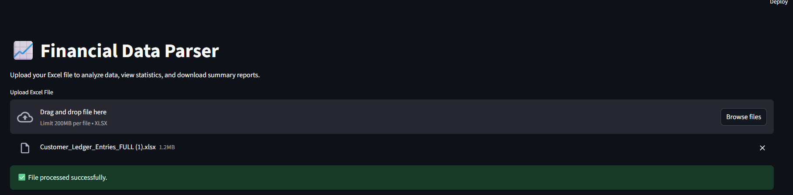
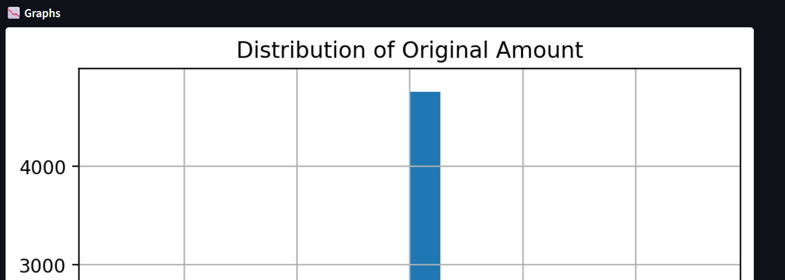
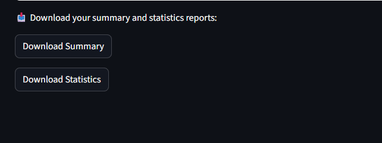

# 💹 Financial Data Parser

A powerful and user-friendly Streamlit application to upload, parse, clean, and visualize financial data from Excel files. Ideal for analysts, finance teams, educators, and developers who need quick insights and summaries from messy spreadsheets.

---

## ✨ Features

- 📤 Upload `.xlsx` Excel files
- 🧹 Automatic column name cleaning
- ❗ Missing value detection
- 📊 Auto-generated summary reports
- 📈 Data visualizations (bar charts, line graphs, heatmaps)
- 📁 Export cleaned data and summary as downloadable Excel files
- ⚡ Bulk processing of multiple files via script

---

## 🚀 Quick Start

### 1. Clone the Repository

```bash
git clone https://github.com/your-username/financial-data-parser.git
cd financial-data-parser
```

### 2. Create a Virtual Environment (Optional but Recommended)

```bash
python -m venv venv
source venv/bin/activate   # On Windows: venv\Scripts\activate
```

### 3. Install Requirements

```bash
pip install -r requirements.txt
```

### 4. Run the Streamlit App

```bash
streamlit run app.py
```

---

## 📁 Project Structure

```
financial-data-parser/
│
├── app.py                      # Streamlit frontend
├── main.py                     # Bulk processing script
├── requirements.txt
│
├── data/sample/                # Place your Excel files here
├── output/                     # Output summaries and cleaned files
│
└── src/
    ├── __init__.py
    ├── excel_processor.py      # Data cleaning and summarization
    ├── utils.py                # Helper functions
    └── visualizer.py           # Chart generation
```

---

## 🛠️ How It Works

- Drop your `.xlsx` files in the `data/sample/` folder or use the **Streamlit uploader**.
- The app:
  - Cleans column names
  - Detects and lists missing values
  - Generates visual summaries
  - Allows download of cleaned + processed files
- A summary report is saved to `output/summary_report.xlsx`.

---

## 📦 Bulk File Processing (CLI)

To process all `.xlsx` files in `data/sample`:

```bash
python main.py
```

---

## 📷 Screenshots

### 🔹 Upload Interface


### 🔹 Example Graph


### 🔹 Report Download Options


---

## 🧠 Future Improvements

- PDF export of reports
- AI-powered insights on financial trends
- Database integrations (e.g., SQLite, PostgreSQL)

---

## 👨‍💻 Author

**Ahmed Khan**  
*AI & Web Developer*  
[GitHub]([https://github.com/your-username](https://github.com/DreamWalker101)) | [LinkedIn]([https://linkedin.com/in/your-profile](https://www.linkedin.com/in/ahmed-abbasi-15619822b/))

---

## 📄 License

This project is licensed under the [MIT License](LICENSE).
